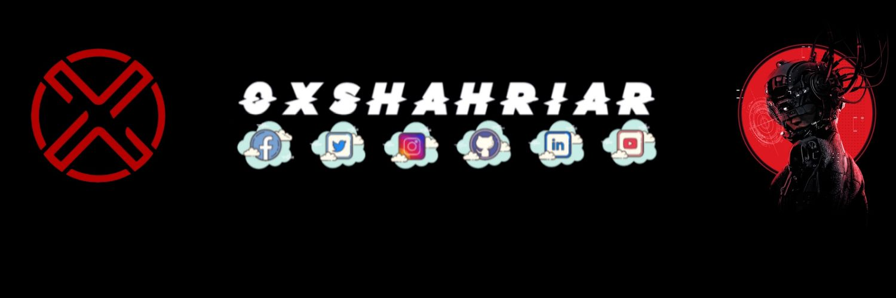

<h1 align='center'>

Hey there !!
 
I'm Md. Shahriar Alam Shaon
 

</h1>

### Some words about me 😁
- I am a Muslim from, Bangladesh. 🇧🇩
- I am a student of Medical Science at, <a href="https://en.m.wikipedia.org/wiki/Chandpur_Medical_College">Chandpur Medical College</a>.
- I am a noob programmer .
- I love cats.
- Afraid of fake friends.

---
<h2> Skills  </h2>

---
### My latest github metrics

---
 <b>I love connecting with different peoples around the whole world</b>. So if you want to say hi, <b>I'll be happy to meet more !</b> 😃 

📫 Here is my contact links,

### Before you leave here is a joke for you,

